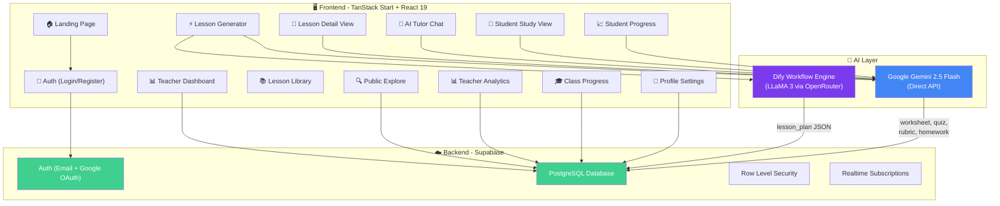
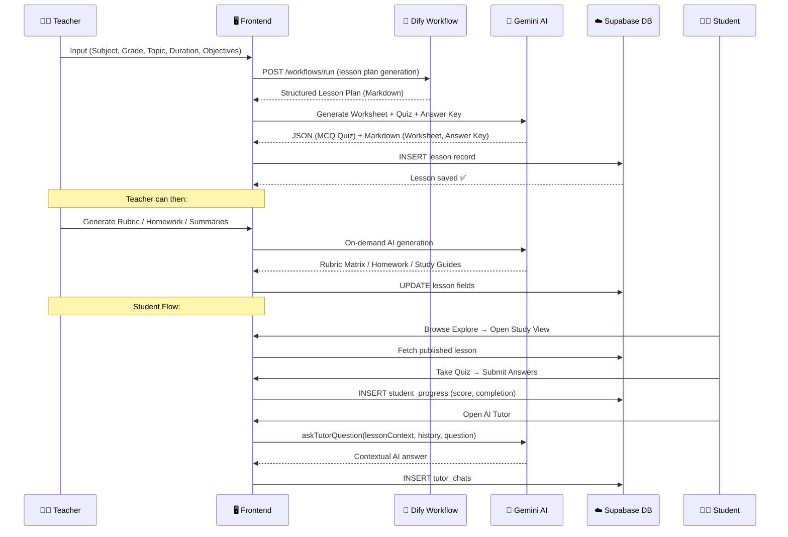
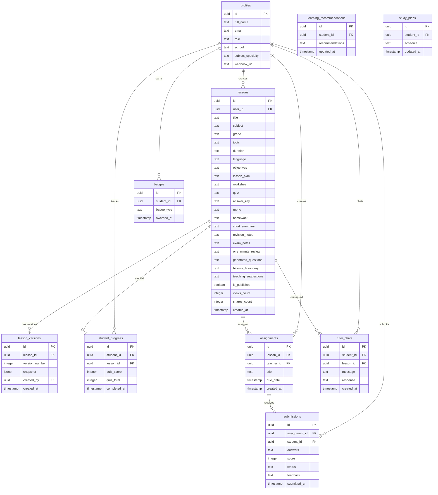
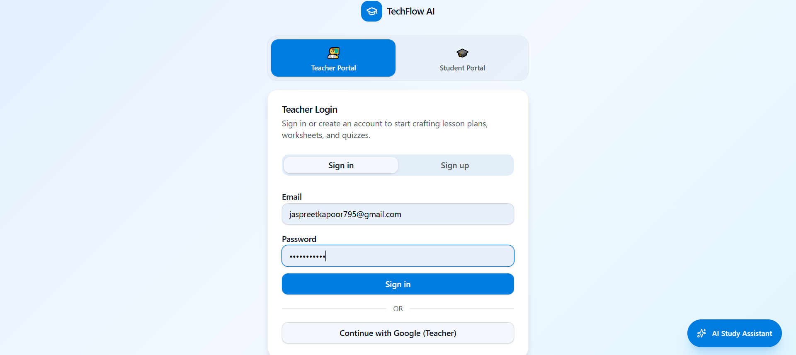

<p align="center">
  
</p>

<h1 align="center">🎓 TechFlow AI</h1>

<p align="center">
  <strong>AI-Powered Lesson Kit Generator & Intelligent Study Platform</strong>
</p>

<p align="center">
  <em>Generate complete lesson plans, worksheets, quizzes, rubrics, homework & study guides — in seconds, in 7 languages.</em>
</p>

<p align="center">
  
  
  
  
  
  
  
  
</p>

<p align="center">
  <a href="#-live-demo">Live Demo</a> •
  <a href="#-features">Features</a> •
  <a href="#-architecture">Architecture</a> •
  <a href="#-installation">Installation</a> •
  <a href="#-screenshots">Screenshots</a> •
  <a href="#-roadmap">Roadmap</a>
</p>

---

## 📋 Table of Contents

- [Product Overview](#-product-overview)
  - [Project Explainer Diagrams](#-project-explainer-diagrams)
- [Problem Solved](#-problem-solved)
- [Solution Architecture](#-solution-architecture)
- [Features](#-features)
- [Workflow Explanation](#-workflow-explanation)
- [Tech Stack](#-tech-stack)
- [Installation Steps](#-installation-steps)
- [Environment Variables](#-environment-variables)
- [Screenshots](#-screenshots)
- [Future Roadmap](#-future-roadmap)
- [Creator Information](#-creator-information)
- [License](#-license)

---

## 🌟 Product Overview

**TechFlow AI** is a full-stack AI-powered educational SaaS platform that empowers **teachers** and **students** with intelligent content generation and personalized learning experiences.

Teachers input a subject, grade, topic, and learning objectives — and TechFlow AI generates a **complete lesson kit** including structured lesson plans, student worksheets, practice quizzes (with MCQ auto-grading), answer keys, grading rubrics, and homework assignments. Students access a public study library, take quizzes, earn XP & badges, chat with an AI tutor, generate flashcards, and receive personalized study plans.

The platform supports **7 languages** (English, Hindi, French, Spanish, German, Japanese, Chinese) with full UI localization and AI output translation, making it accessible to a global audience.

> **🎯 Target Users:** K-12 Teachers, Educators, Students, Tutoring Centers, and EdTech Organizations.

### 🎨 Project Explainer Diagrams

<p align="center">
  
</p>

<p align="center">
  
</p>

---

## 🔍 Problem Solved

| Problem | Impact |
|---------|--------|
| 🕐 **Teachers spend 5–10 hours/week** creating lesson plans, worksheets, and quizzes manually | Lost teaching time, burnout |
| 📝 **No unified tool** to generate lesson plan + worksheet + quiz + rubric + homework together | Fragmented workflow across multiple tools |
| 🌐 **Language barriers** for non-English-speaking educators | Excludes millions of teachers globally |
| 📊 **No student progress tracking** in traditional lesson-prep tools | Teachers can't measure learning outcomes |
| 🤖 **Students lack AI tutoring** tied to specific lesson content | Generic AI assistants don't understand the curriculum context |
| 🎯 **No gamification** in traditional study platforms | Low student engagement and motivation |

**TechFlow AI solves all of these** by combining AI-powered content generation with a full classroom management system, multilingual support, and gamified student engagement — all in a single platform.

---

## 🏗 Solution Architecture

### High-Level Architecture Diagram



### Data Flow Diagram



---

## ✨ Features

### 👩‍🏫 For Teachers

| Feature | Description |
|---------|-------------|
| ⚡ **One-Click Lesson Kit Generation** | Generate a complete lesson plan, worksheet, practice quiz, and answer key in one click |
| 📋 **AI Grading Rubric** | Generate structured assessment rubrics with 4-level criteria matrices |
| 📝 **AI Homework Generator** | Create take-home assignments aligned with lesson objectives |
| 🔄 **Smart Regeneration** | Regenerate individual sections with custom instructions (e.g., "make the quiz easier") |
| 📖 **Version History** | Every edit creates a snapshot; restore any previous version instantly |
| 📑 **Duplicate & Adapt** | Clone any lesson and adapt it for a different grade, subject, or language |
| 📊 **Teacher Analytics Dashboard** | Track lessons created, published, student views, shares, and usage trends with interactive charts |
| 🎓 **Class Progress Portal** | Create shareable assignment links, track student submissions, and provide feedback/grades |
| 📤 **Export to PDF** | Download individual sections or the complete lesson kit as a beautifully formatted PDF |
| ✉️ **Email Sharing** | Share lesson content directly via email |
| 🌐 **Publish to Library** | Toggle lessons between private and public; published lessons appear in the global Explore library |

### 🧑‍🎓 For Students

| Feature | Description |
|---------|-------------|
| 📚 **Public Study Library** | Browse all published lessons — no account required |
| 📝 **Interactive Quiz Taking** | Take MCQ quizzes with instant auto-grading and score tracking |
| 🤖 **AI Tutor (Doubt Solver)** | Chat with an AI tutor that has full context of the lesson plan and worksheet |
| 🃏 **AI Flashcard Generator** | Generate study flashcards on any topic with adjustable difficulty |
| 🔊 **Read Aloud (TTS)** | Listen to lesson content, flashcards, and AI responses via browser text-to-speech |
| 📈 **Progress Dashboard** | Track streaks, XP points, quiz averages, and completed lessons |
| 🏆 **Gamification & Badges** | Earn badges (First Steps, Quiz Master, Perfect Score, Weekly Learner, Consistent Learner) |
| 🥇 **Leaderboard** | Compete with classmates on a points-based leaderboard |
| 🧠 **AI Study Recommendations** | Get personalized revision topics and learning suggestions based on quiz performance |
| 📅 **AI Study Plan Generator** | Generate a weekly study schedule tailored to weaker subjects |
| 📖 **Study Guides & Summaries** | AI-generated short summaries, revision notes, exam notes, and 1-minute reviews |
| 💡 **Bloom's Taxonomy Questions** | AI-generated questions across all 6 cognitive levels |
| ✍️ **Assignment Submission** | Submit quiz answers via shareable assignment links |

### 🌐 Platform-Wide

| Feature | Description |
|---------|-------------|
| 🌍 **7-Language Support** | Full UI + AI output in English, Hindi, French, Spanish, German, Japanese, Chinese |
| 🌙 **Dark / Light Theme** | System-aware theme toggle with smooth transitions |
| 🔐 **Role-Based Access** | Teacher and Student roles with different dashboards and capabilities |
| 🔑 **Google OAuth + Email Auth** | Secure authentication via Supabase Auth |
| 💬 **Floating Study Assistant** | Global AI chat widget available on every page, context-aware of the active lesson |
| 📱 **Responsive Design** | Fully responsive UI optimized for desktop, tablet, and mobile |

---

## 🔄 Workflow Explanation

### Teacher Lesson Generation Flow

```
1️⃣  Teacher logs in → Navigates to "Generate Lesson"
2️⃣  Fills in: Subject, Grade, Topic, Duration, Language, Learning Objectives
3️⃣  System checks for:
    ├── Dify Workflow URL (from profile) → Calls Dify API (LLaMA 3 via OpenRouter)
    ├── Gemini API Key (from profile/env) → Falls back to Gemini 2.5 Flash
    └── No API configured → Uses built-in demo generator
4️⃣  AI generates: Lesson Plan (structured Markdown)
5️⃣  System then calls Gemini to generate:
    ├── Student Worksheet (Markdown)
    ├── Practice Quiz (JSON array of MCQ objects)
    └── Answer Key (Markdown)
6️⃣  All outputs saved to Supabase → Lesson appears in Library
7️⃣  Teacher can optionally generate:
    ├── Grading Rubric (JSON matrix)
    ├── Homework Assignment (Markdown)
    ├── Study Summaries, Question Banks, Bloom's Taxonomy, Teaching Suggestions
8️⃣  Teacher publishes lesson → Available in public Explore library
9️⃣  Teacher creates assignment link → Shares with students
```

### Student Study Flow

```
1️⃣  Student browses Explore library (no account needed to read)
2️⃣  Opens a lesson → Reads plan, worksheet, and study materials
3️⃣  Takes the interactive quiz → Answers auto-graded instantly
4️⃣  Score saved to student_progress → XP calculated, badges checked
5️⃣  Opens AI Tutor → Asks questions with full lesson context
6️⃣  Generates flashcards → Studies with flip cards, shuffle, and TTS
7️⃣  Views Progress Dashboard → Streaks, leaderboard, subject mastery chart
8️⃣  Generates AI Recommendations → Personalized revision topics
9️⃣  Generates Study Plan → Weekly schedule targeting weak subjects
```

---

## 🛠 Tech Stack

### Frontend

| Technology | Purpose |
|-----------|---------|
| [React 19](https://react.dev) | UI library with latest concurrent features |
| [TypeScript](https://typescriptlang.org) | Type-safe development |
| [TanStack Start](https://tanstack.com/start) | Full-stack React framework (SSR + Server Functions) |
| [TanStack Router](https://tanstack.com/router) | File-based type-safe routing |
| [TanStack Query](https://tanstack.com/query) | Async state management and caching |
| [Tailwind CSS 4](https://tailwindcss.com) | Utility-first CSS framework |
| [Radix UI](https://radix-ui.com) | Accessible, unstyled component primitives |
| [shadcn/ui](https://ui.shadcn.com) | Beautiful component library built on Radix |
| [Recharts](https://recharts.org) | Declarative charts for analytics dashboards |
| [Lucide React](https://lucide.dev) | Beautiful, consistent icon library |
| [jsPDF](https://github.com/parallax/jsPDF) | Client-side PDF generation and export |
| [Sonner](https://sonner.emilkowal.dev) | Elegant toast notifications |
| [Vite 7](https://vitejs.dev) | Lightning-fast build tool and dev server |
| [Zod](https://zod.dev) | Runtime schema validation |

### Backend & AI

| Technology | Purpose |
|-----------|---------|
| [Supabase](https://supabase.com) | Auth, PostgreSQL DB, Row Level Security, Realtime |
| [Google Gemini 2.5 Flash](https://ai.google.dev) | Primary AI engine for content generation, tutoring, and recommendations |
| [Dify](https://dify.ai) | Workflow orchestration engine for structured lesson plan generation |
| [OpenRouter](https://openrouter.ai) | Multi-model API gateway (LLaMA 3 via Dify) |

### Database Schema (Supabase PostgreSQL)



---

## 🚀 Installation Steps

### Prerequisites

- **Node.js** ≥ 18.x
- **npm** ≥ 9.x
- A **Supabase** project (free tier works)
- A **Google Gemini API Key** (free tier available at [ai.google.dev](https://ai.google.dev))
- *(Optional)* A **Dify** account with the workflow imported

### 1. Clone the Repository

```bash
git clone https://github.com/your-username/techflow-ai.git
cd techflow-ai
```

### 2. Install Dependencies

```bash
cd Frontend
npm install
```

### 3. Configure Environment Variables

```bash
cp .env.example .env
```

Edit `.env` and fill in your actual values (see [Environment Variables](#-environment-variables) below).

### 4. Set Up Supabase

1. Create a new project at [supabase.com](https://supabase.com)
2. Run the database migrations (SQL files) to create the required tables:
   - `profiles`, `lessons`, `lesson_versions`, `student_progress`, `badges`, `assignments`, `submissions`, `tutor_chats`, `learning_recommendations`, `study_plans`
3. Enable **Google OAuth** in Supabase Auth settings
4. Configure Row Level Security (RLS) policies for each table

### 5. Import the Dify Workflow *(Optional)*

1. Sign up at [dify.ai](https://dify.ai)
2. Import the workflow file: `Backend/TechFlow AI.yml`
3. Configure the OpenRouter API key in Dify
4. Copy the workflow API URL to your profile settings in the app

### 6. Start the Development Server

```bash
npm run dev
```

The app will be available at `http://localhost:5173`

### 7. Build for Production

```bash
npm run build
npm run preview
```

---

## 🔐 Environment Variables

Create a `.env` file in the `Frontend/` directory based on the `.env.example` template:

| Variable | Required | Description |
|----------|----------|-------------|
| `VITE_SUPABASE_URL` | ✅ | Your Supabase project URL |
| `VITE_SUPABASE_PUBLISHABLE_KEY` | ✅ | Your Supabase anon/public key |
| `SUPABASE_URL` | ✅ | Supabase URL for server-side operations |
| `SUPABASE_PUBLISHABLE_KEY` | ✅ | Supabase key for server-side operations |
| `SUPABASE_SERVICE_ROLE_KEY` | ⚠️ | Service role key (for admin operations) |
| `VITE_GEMINI_API_KEY` | ⚠️ | Google Gemini API key (fallback; users can also set via Profile) |
| `VITE_DIFY_API_KEY` | ❌ | Dify workflow API key (optional) |
| `VITE_DIFY_API_URL` | ❌ | Dify API base URL (default: `https://api.dify.ai/v1`) |

> **Note:** Users can configure their own Gemini API key and Dify Webhook URL from their Profile page. The environment variables serve as defaults/fallbacks.

---

## 📸 Screenshots

### Landing Page


### Login (Google OAuth + Email)


### Teacher Dashboard


### AI-Generated Lesson Kit


### AI-Generated Lesson Plan


### Dify AI Workflow


### Database Schema Visualizer


### Database Tables


### Google OAuth Configuration


---

## 🗺 Future Roadmap

| Phase | Feature | Status |
|-------|---------|--------|
| 🔜 **v2.1** | Real-time collaborative lesson editing (multiplayer) | 🔲 Planned |
| 🔜 **v2.1** | AI-powered differentiated instruction (IEP/504 accommodations) | 🔲 Planned |
| 🔜 **v2.2** | Voice-to-lesson: speak your lesson idea, AI builds the kit | 🔲 Planned |
| 🔜 **v2.2** | Student notebook / annotation system | 🔲 Planned |
| 🔜 **v2.3** | Parent portal with progress reports | 🔲 Planned |
| 🔜 **v2.3** | LMS integrations (Google Classroom, Canvas, Moodle) | 🔲 Planned |
| 🔜 **v3.0** | AI-generated video explanations per lesson | 🔲 Planned |
| 🔜 **v3.0** | Mobile apps (iOS + Android via React Native) | 🔲 Planned |
| 🔜 **v3.1** | Multi-tenant school/organization management | 🔲 Planned |
| 🔜 **v3.1** | Advanced analytics with predictive student performance | 🔲 Planned |
| 🔜 **v3.2** | Marketplace for teachers to sell premium lesson kits | 🔲 Planned |
| ✅ **v1.0** | Full lesson kit generation (Plan + Worksheet + Quiz + Answer Key) | ✅ Done |
| ✅ **v1.0** | 7-language support with full UI localization | ✅ Done |
| ✅ **v1.0** | Student progress tracking, badges, and leaderboard | ✅ Done |
| ✅ **v1.0** | AI Tutor with lesson-context awareness | ✅ Done |
| ✅ **v1.0** | AI Flashcard generator | ✅ Done |
| ✅ **v1.0** | Teacher analytics dashboard | ✅ Done |
| ✅ **v1.0** | Class progress & assignment management | ✅ Done |
| ✅ **v1.0** | Version history with snapshot & restore | ✅ Done |
| ✅ **v1.0** | PDF export (single section + full kit) | ✅ Done |
| ✅ **v1.0** | AI Rubric & Homework generator | ✅ Done |
| ✅ **v1.0** | AI Study Recommendations & Study Plan | ✅ Done |
| ✅ **v1.0** | Bloom's Taxonomy question generator | ✅ Done |

---

## 🚀 Live Demo

> 🔗 **Live URL:** *Coming soon — deployment in progress*
>
> The app can be self-hosted on any platform that supports Node.js (Vercel, Cloudflare Pages, Railway, etc.)

---

## 👨‍💻 Creator Information

<table>
  <tr>
    <td align="center">
      <strong>Built with ❤️ as a portfolio project</strong>
      <br />
      <em>Full-stack AI SaaS showcasing modern web development,<br />AI integration, and educational technology.</em>
    </td>
  </tr>
</table>

**Key Skills Demonstrated:**
- 🧠 AI/LLM Integration (Gemini, Dify, OpenRouter)
- ⚛️ Modern React 19 with TanStack ecosystem
- 🗄️ Full-stack Supabase (Auth, DB, RLS, Realtime)
- 🎨 Production-quality UI/UX with Tailwind CSS + shadcn/ui
- 🌍 Internationalization (7 languages, full UI + AI output)
- 📊 Data visualization with Recharts
- 🎮 Gamification systems (XP, streaks, badges, leaderboards)
- 📄 Client-side PDF generation with jsPDF

---

## 📄 License

This project is licensed under the **MIT License** — see the [LICENSE](LICENSE) file for details.

```
MIT License

Copyright (c) 2025 TechFlow AI

Permission is hereby granted, free of charge, to any person obtaining a copy
of this software and associated documentation files (the "Software"), to deal
in the Software without restriction, including without limitation the rights
to use, copy, modify, merge, publish, distribute, sublicense, and/or sell
copies of the Software, and to permit persons to whom the Software is
furnished to do so, subject to the following conditions:

The above copyright notice and this permission notice shall be included in all
copies or substantial portions of the Software.

THE SOFTWARE IS PROVIDED "AS IS", WITHOUT WARRANTY OF ANY KIND, EXPRESS OR
IMPLIED, INCLUDING BUT NOT LIMITED TO THE WARRANTIES OF MERCHANTABILITY,
FITNESS FOR A PARTICULAR PURPOSE AND NONINFRINGEMENT. IN NO EVENT SHALL THE
AUTHORS OR COPYRIGHT HOLDERS BE LIABLE FOR ANY CLAIM, DAMAGES OR OTHER
LIABILITY, WHETHER IN AN ACTION OF CONTRACT, TORT OR OTHERWISE, ARISING FROM,
OUT OF OR IN CONNECTION WITH THE SOFTWARE OR THE USE OR OTHER DEALINGS IN THE
SOFTWARE.
```

---

<p align="center">
  <strong>⭐ If you found this project helpful, please consider giving it a star!</strong>
</p>

<p align="center">
  
  
  
</p>
